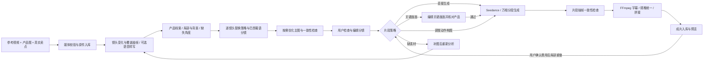

# 设计说明与升级路线

## 产品工作流

一个视频生成模型无法同时可靠完成商品识别、事实审核、字幕排版、音频转写和最终质检。系统将视觉分析、图片编辑、转写、视频生成分别配置。必需视觉分析、视频模型和 TOS；图片编辑与转写可选，但无转写时不能精确复用原口播。

## 产品替换优先级

1. 产品图和真实产品说明控制商品身份：结构、比例、颜色、材质、标识、数量。参考片中的商品只是需要替换的对象。
2. 参考视频控制镜头顺序、画面构图、运镜、开头吸引点和节奏；参考片中的竞品商标、价格及不适用功效不能成为目标商品事实。
3. 每段独立带入关联产品图、产品档案和其覆盖镜头的约束。直接生成可额外参考上一段抽样检查通过的**裁剪后可见的末帧**，改善空间与光线一致性；关键画面策略改用核对后的关键画面，关键画面和改编策略均不输入原视频。参考图片不等同于锁定首尾帧。
4. 一张产品图即可开始。分析根据实际镜头记录已知角度、未知结构和缺失素材，并识别完整、局部、背景、遮挡等出现方式以及操作状态。不要求每种商品固定上传同一组角度；未知结构不能当成目标产品事实。

`product_profile` 保存外观特征、部件、已知角度、未知信息与不得沿用的原款特征。`shots` 保存时间、产品出现方式、可见部件、操作、缺失角度、约束和关联产品图；`segments` 按生成时长合并这些镜头，保存关联镜头索引、产品图索引、策略和修复要求。普通分镜表单保存保留这些结构。

## 片段策略与检查

| 策略 | 输入及处理 | 使用边界 |
| --- | --- | --- |
| 直接生成 | 目标图片、产品与部件约束、原视频片段 | 现有角度足够、操作可以迁移 |
| 关键画面引导 | 每段用一张代表画面与目标产品图多图编辑，再视觉核对，成功后代替原视频作为生成参考 | 必须已选择支持多图编辑的图片模型；不能修造未知真实结构，不是逐帧掩膜编辑，单张关键画面不能保证整段运动一致 |
| 调整动作与构图 | 使用目标图片与明确改编描述，不向视频模型输入原视频 | 原操作不适合目标产品，或需要降低原产品外观干扰；相似度可能降低 |
| 需补素材 | 阻止生成，等待补充真实照片或用户明确选择改编 | 不静默跳过困难镜头 |

所有片段生成后均进行有限抽帧检查，包括旧产品残留、两款特征混合、几何结构变化、不适用操作和原字幕/文字残留。报告记录问题类别、严重程度、片段内时间、说明和建议，界面转换为全片时间。模型错误、无可用帧或无法判断时保守标为待确认；这不是全帧验证，也不评估音轨。

有问题或无法确定的结果仍可合成下载，项目状态为 `needs_review`；全部片段抽样检查通过才标 `completed`。用户可复查现有片段（视觉费用，不生成视频），或在全部片段已有结果、无活动任务时主动提交局部重做。局部重做保存旧视频与报告，保留其他片段并重新合成；上次成片在新合成完成前保持可用。每段视频最多提交 3 次，包含首次，检查不合格不会自动重试计费。关键画面失败或提交未知时停止，可只保存新策略后主动重试。

图片处理保留原件；透明区域铺白不等同于抠图，保守放大不等同于恢复真实细节。图片编辑模型可清理背景，视觉比较只是一道辅助检查，不能保证商标细字完全一致。微小或特殊长宽比的图在模型输入前增加白边以满足最小尺寸，不裁掉产品。

## 复刻等级

| 等级 | 保留内容 | 难点处理 |
| --- | --- | --- |
| 创意借鉴 | 卖点、开头和整体节奏 | 允许重设计镜头和动作 |
| 平衡复刻（默认） | 镜头顺序、卖点、节奏 | 复杂遮挡/接触可简化，但必须写明改动 |
| 高相似度 | 构图、运镜、时序和主要动作 | 保留难点，逐段标注风险 |
| 严格复刻 | 最大程度保留镜头、动作与布景 | 不得静默删镜头，交给用户判断风险 |

等级不是“越高质量越好”。更高相似度减少模型的调整空间，在细小商品、透明材质、快速变形、多人动作和手部遮挡场景中可能降低成功率。产品真实外观始终优先于动作相似度。本项目没有声称能给出客观相似度百分比。

## 巴西本地化与音画

BR 是默认站点，UI 保持中文，生成的口播和叠加文字使用 pt-BR。真实产品商标保持原样。分镜可编辑，要求不编造价格、促销、认证和功效。

字幕由 FFmpeg 使用 ASS 字幕烧录，而非让视频模型绘制文字。用户字符串写入隔离的字幕文件并处理控制语法，不拼入 shell。第一版每个生成片段使用该片段的字幕文字，尚未按短句自动切分和逐词对齐。

背景音乐和口播分别提供开关，但模型接口只有混合音轨总开关，因此单项开关用提示词约束，两项均关闭时 FFmpeg 移除所有音轨。未来需要独立音乐素材、pt-BR TTS 和混音流程，以获得更稳定的跨片段声音。

## 长视频和时长

Seedance 2.0 与本项目的万相 3.0 适配均按每段 4–15 秒整数、管理员配置的上限规划。万相的 30 秒单次模式暂不开放，继续使用统一分段和 FFmpeg 拼接流程。优先使用检测到的视觉切点；短镜头可合并、长镜头可拆分，无切点时回退到均衡分段。目标非整数时长先向上取整生成再裁剪；总时间按原视频或用户指定时长保留，固定 30 fps 时存在约一帧量化误差。

分析最多使用 36 张镜头变化与时间覆盖抽帧。检测的是视觉变化，不能保证找到所有语义镜头；有限抽样会漏掉极短动作。新分析若缺失视角且没有明确改编、或镜头记录未覆盖该片段，会标为需补素材；用户可补图重新分析或明确调整策略。每段提示词包含该时间窗口内的全部已识别镜头，源参考片段按时间映射取样，最长 15 秒。自定义总时长时，将完整对应源区间按比例加速/减速至可输入时长，避免截去区间末尾动作；参考音轨同步变速。用户可在生成前编辑 JSON 时间线，只要连续、总时长相同且每段不超过模型上限，镜头归属会按修改后的时间重新计算。

FFmpeg 统一画布、帧率、编解码与音轨；按比例增加黑边而不裁掉商品。硬切保留原时间，不默认叠化以免改变总时长。短音轨补静音。明显短于计划的模型输出会停止并提示核查，不能把缺失内容当作成功。

## 服务和数据库

- FastAPI 同源提供静态网页和 API；浏览器不会直接持有模型密钥。
- SQLite WAL + SQLAlchemy ORM；Alembic 初始版本固定表结构，后续变更创建新迁移。
- 表：`users`、`sessions`、`models`、`settings`、`projects`、`assets`、`jobs`、`segments`、`audit`。
- `assets.data` 保存 BLOB，记录 MIME、大小、SHA256、所属用户、角色与元信息。视频预览支持 Range，使用数据库分块读取。
- 主密钥在 `data/app.key`；API/TOS 密钥用 Fernet 加密后入库。主密钥与数据库分离使单独泄漏数据库不直接暴露服务密钥，但能控制服务器文件的人仍具有管理能力。
- 队列和模型任务 ID 持久化。一个服务进程、一个串行 worker，最多每用户 5 个活动/排队任务，默认文件与存储额度可配置。
- 服务用本地锁防止同数据目录启动多个进程。云端多副本需升级为独立 worker、共享队列和数据库任务租约，当前不能直接横向扩容。

HTTP API 主要路径：`/api/auth/*`、`/api/users`、`/api/models`、`/api/settings/storage`、`/api/projects`、`/api/projects/{id}/assets`、`analyze`、`plan`、`generate`、`review`、`retry`、`cancel`、`/api/segments/{id}/regenerate`、`strategy`、`/api/assets/{id}`。

## 失败、取消和重复计费

分析模型的原始返回内容先作为 `analysis_raw` 素材入库，再做安全的本地格式规范化和 `AnalysisPlan` 校验。文本列表字段的单字符串可转换为单项列表，可为空的列表 `null` 可转换为空列表；不会用空值掩盖必需内容缺失，也不会推测镜头时间或真实产品结构。校验错误转换为中文字段原因，原始结果可由项目所属用户在素材列表查看。

普通分析重试会在素材、项目设置及所选模型未变化时复用最近保存的返回结果。需要模型纠正个别字段格式时，对该返回结果最多发起一次文本修复，只允许返回指定字段的修正，不重新输入图片或请求完整分镜；修复回复保存为 `analysis_repair`。截断、非法 JSON、必要内容缺失及时间线等实质错误不会自动重跑视觉分析。用户主动选择重新分析才使旧返回结果失效，并调用模型生成新结果；旧素材保留。升级前未保存的回复无法恢复，首次重试需获取新回复。

提交前先保存片段状态 `submitting`；取得供应商 ID 后立即入库，然后只查询该 ID。网络超时、5xx 或缺少 ID 时，远端可能已经创建收费任务，因此标记待核对，不自动重新 POST。管理员在片段面板关联供应商任务 ID，再点击重试。

确认失败的供应商任务在用户主动重试时才重新提交，也可先保存新策略，原失败任务 ID 会归档且不会重置次数；已成功入库的片段复用。服务中断时将运行任务标记为需要处理，重试继续已保存进度。取消只在安全检查点停止本地处理，不保证撤销供应商已受理任务或免除费用。

可选主图优化与关键画面编辑均在提交前持久记录状态。编辑返回后先保存图片，再调用视觉核对；主图优化无法确认时保留原图。未知提交或未通过核对的修图不会因普通重试自动重复计费。

任务记录保留状态和错误，不显示可能含密钥的供应商原始响应。供应商成功下载地址有时效，因此应及时恢复下载，不能把任务 ID 当成永久文件备份。

## 云数据库迁移

现阶段所有媒体直接入库符合当前要求，但大量视频会快速增大 SQLite 与备份体积。建议后期使用阿里云 RDS PostgreSQL 存业务数据、OSS/TOS 存大媒体，由统一存储接口保留资产 ID；当前版本已把媒体写入集中在 `storage.add_asset`，但**尚未实现长期 OSS/TOS 资产后端**，当前 TOS 仅用于中转。

保留 BLOB 的迁移步骤：

1. 对源库执行 `python -m app.cli backup` 并保管 `app.key`。
2. 安装 PostgreSQL 驱动：`pip install "psycopg[binary]"`。
3. 在单独终端设置目标 `DATABASE_URL`，对**空目标库**运行 `python -m alembic upgrade head`，随后关闭该终端，避免误用目标环境。
4. 停止旧应用，在仍指向源库的终端运行 `python -m app.cli migrate-data --target-url "postgresql+psycopg://..."`。目标任意业务表非空会拒绝复制；事务失败整体回滚；不复制旧登录会话。
5. 复制主密钥，切换 `DATABASE_URL`，核对用户/项目/任务/素材数量与媒体 SHA256，再让团队使用。
6. 保留旧库只读备份。上线验证通过前不要删除旧数据。

该复制工具逐行搬运 BLOB，减少内存峰值；没有改写原库。SQLite 到 PostgreSQL 的真实云迁移未在本机验证。阿里云 MySQL 需要额外处理 BLOB 容量类型、连接驱动和包大小，不能只改连接字符串就视为已完成适配。

## 下一阶段优先项

1. 接入真实账号，用 10–15 秒、单产品、简单动作样片验收，再测试长片和复杂动作。
2. 更密集的动态追踪、OCR 和镜头级原字幕提取，降低有限抽样对快速露出与遮挡的漏检。
3. 独立 pt-BR TTS、逐词时间戳、背景音乐贯穿整片和响度统一。
4. 多关键画面和完整动作验证、跨片段联检，以及结果版本的并排比较；当前检查仍是片段内稀疏抽帧。
5. 素材删除/回收站、团队配额界面、实际费用记录、对象存储资产迁移、独立图片制作模块。
